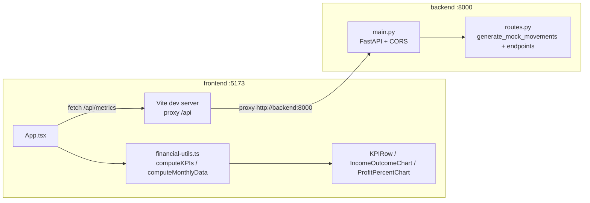

# Arquitectura

## Esquema visual del repositorio del dashboard

```text
ai-eng-financial-dashboard-context-project/
├─ docker-compose.yml          # Orquesta los servicios "frontend" y "backend"
├─ AGENTS.md                   # Reglas para agentes de IA que trabajen en el repo
├─ product-context.md          # Contexto de producto (resumen, features, personas, métricas)
├─ memory-bank                 # Reconocimiento del código para agentes (archivo, no carpeta)
│
├─ backend/                    # API FastAPI
│  ├─ Dockerfile                # Imagen python:3.13-slim + uvicorn/debugpy
│  ├─ requirements.txt          # fastapi, uvicorn, debugpy, pytest, pytest-cov, httpx
│  └─ app/
│     ├─ __init__.py
│     ├─ main.py                # Bootstrap de FastAPI + CORS + monta el router
│     └─ routes.py              # Modelos Pydantic, generación de mock data y endpoints /api/*
│  └─ tests/
│     ├─ conftest.py            # Ajusta sys.path para importar "app"
│     └─ test_routes.py         # Tests de endpoints y funciones de dominio (pytest)
│
└─ frontend/                   # SPA React + TypeScript
   ├─ Dockerfile                # Imagen node:24-alpine + "npm run dev"
   ├─ vite.config.ts            # Plugins (react, tailwindcss) + proxy "/api" → backend:8000
   ├─ package.json              # Scripts y dependencias (React, Recharts, Tailwind, Vitest)
   ├─ tsconfig*.json             # Configuración de TypeScript (app/node/base)
   ├─ index.html                 # Punto de montaje del SPA
   └─ src/
      ├─ main.tsx               # Entry point: monta <App /> en el DOM (#root)
      ├─ App.tsx                # Orquesta fetch a la API y composición del layout
      ├─ index.css              # Tokens de tema Tailwind (claro/oscuro)
      ├─ lib/
      │  ├─ financial-types.ts       # Tipos compartidos (FinancialMovement, KPIMetrics, etc.)
      │  ├─ financial-utils.ts       # Cálculo de KPIs y agregación mensual (lógica de negocio en cliente)
      │  ├─ financial-utils.test.ts  # Tests unitarios (Vitest)
      │  ├─ mock-data.ts             # Dataset estático de respaldo/demo
      │  └─ utils.ts                 # Helper "cn" para combinar clases CSS
      └─ components/
         ├─ dashboard/
         │  ├─ dashboard-header.tsx      # Encabezado con título y periodo
         │  ├─ kpi-row.tsx               # Compone las 4 tarjetas KPI
         │  ├─ kpi-card.tsx              # Tarjeta KPI individual (con estado skeleton)
         │  ├─ income-outcome-chart.tsx  # Gráfico de línea ingresos vs. egresos (Recharts)
         │  └─ profit-percent-chart.tsx  # Gráfico de línea del margen de utilidad (Recharts)
         └─ ui/
            ├─ card.tsx                  # Primitivas de tarjeta reutilizable
            └─ skeleton.tsx              # Placeholder de carga reutilizable
```

## Relación entre Frontend y Backend

El acoplamiento entre ambas capas es **HTTP/REST sobre un proxy de desarrollo**, sin backend-for-frontend intermedio ni SSR:

1. **Arranque de servicios** ([docker-compose.yml](docker-compose.yml)): levanta dos contenedores, `frontend` (puerto `5173`) y `backend` (puertos `8000` y `5678` para debug), donde `frontend` declara `depends_on: backend`.
2. **Proxy de peticiones** ([frontend/vite.config.ts](frontend/vite.config.ts)): el servidor de desarrollo de Vite redirige cualquier petición a `/api` hacia `http://backend:8000` (nombre del servicio Docker), evitando problemas de CORS/URLs en local sin variables de entorno adicionales.
3. **Llamada desde el cliente** ([frontend/src/App.tsx](frontend/src/App.tsx)): la función `fetchFinancialData()` hace `fetch(`${API_BASE_URL}/api/metrics`)`, donde `API_BASE_URL` es `import.meta.env.VITE_API_BASE_URL ?? ""` (vacío en desarrollo, usa el proxy; configurable en producción).
4. **Endpoint consumido** ([backend/app/routes.py](backend/app/routes.py)): `GET /api/metrics` genera datos mock deterministas (`generate_mock_movements(seed=42)`) y responde una lista de `FinancialMovement` (modelo Pydantic) serializada a JSON.
5. **Middleware CORS** ([backend/app/main.py](backend/app/main.py)): `CORSMiddleware` con `allow_origins=["*"]` permite que el backend acepte peticiones desde cualquier origen (relevante si el frontend no usa el proxy, p. ej. en producción con `VITE_API_BASE_URL` apuntando directo al backend).
6. **Transformación en cliente** ([frontend/src/lib/financial-utils.ts](frontend/src/lib/financial-utils.ts)): las funciones `computeKPIs()` y `computeMonthlyData()` reciben el arreglo crudo de `FinancialMovement` y derivan, en el navegador, los KPIs (ingresos, egresos, utilidad neta, margen %) y la serie mensual — el backend **no** hace estas agregaciones para este endpoint (sí las expone en `/api/metrics/summary`, `/api/metrics/categories/top`, etc., pero esos endpoints no están conectados aún al frontend).
7. **Renderizado**: `App.tsx` pasa `metrics` y `monthlyData` como props a `KPIRow`, `IncomeOutcomeChart` y `ProfitPercentChart`, junto con estados `loading`/`error` gestionados con `useEffect`/`useState`.
8. **Contrato de tipos duplicado**: los tipos de dominio están definidos por separado en Python (`FinancialMovement` en [routes.py](backend/app/routes.py)) y en TypeScript ([frontend/src/lib/financial-types.ts](frontend/src/lib/financial-types.ts)) — no existe generación automática de tipos ni esquema compartido; la consistencia se valida solo mediante las pruebas de cada lado.



## Stack tecnológico

**Backend**
- Python 3.13 ([backend/Dockerfile](backend/Dockerfile))
- FastAPI (framework web/API) + Pydantic (modelos/validación)
- Uvicorn con `--reload` (servidor ASGI de desarrollo)
- debugpy (depuración remota expuesta en el puerto `5678`)
- pytest + pytest-cov (tests y cobertura)
- httpx (usado internamente por `TestClient` de FastAPI)

**Frontend**
- Node.js 24 ([frontend/Dockerfile](frontend/Dockerfile))
- React 19 + ReactDOM 19
- TypeScript ~6.0
- Vite 8 (dev server y bundler) con `@vitejs/plugin-react`
- Tailwind CSS 4 (vía `@tailwindcss/vite`) + `autoprefixer`/`postcss`
- Recharts 3 (gráficos de línea)
- Utilidades de estilos: `class-variance-authority`, `clsx`, `tailwind-merge`
- Iconografía: `lucide-react`
- ESLint 9 + `typescript-eslint` (linting)
- Vitest 4 + `@vitest/coverage-v8` (tests unitarios y cobertura)

**Infraestructura y tooling**
- Docker + Docker Compose (orquestación de los dos servicios, `docker compose up --build`)
- Proxy HTTP integrado en Vite (`/api` → `backend:8000`), sin necesidad de variables de entorno en desarrollo
- Documentación de API autogenerada por FastAPI (Swagger UI) en `/docs`
